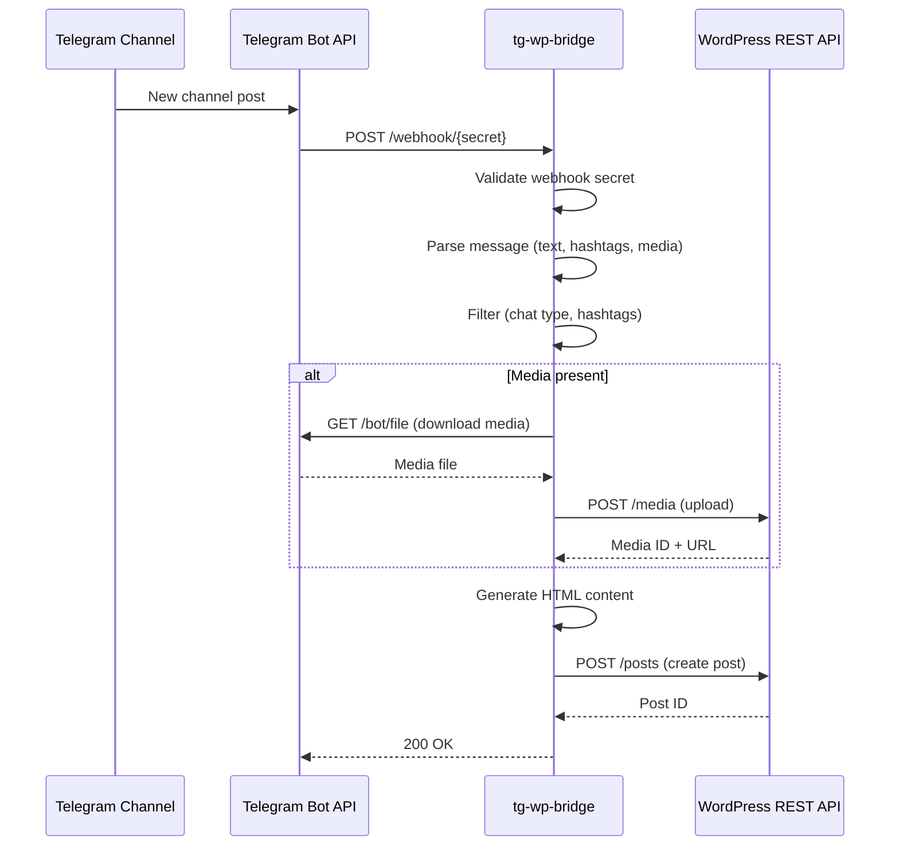

# Telegram to WordPress Bridge

A minimal FastAPI service that mirrors Telegram channel posts to WordPress blog posts via the REST API.

## Concept

```ascii
[Telegram Channel]
        |
        | (forwarded via bot)
        v
[Telegram Bot Webhook (our service, in Docker)]
        |
        | 1. Parse message (text + media URLs)
        | 2. Optionally download media
        | 3. POST to WordPress REST API
        v
[WordPress REST API]
        |
        v
[New Post in Category X]
```

Each channel message becomes a WordPress post:

- **Text** → post title & content
- **Media** (photos, videos, documents) → uploaded to WordPress and embedded

No WordPress plugin required; uses built-in REST API + Application Passwords.

### Message Flow

``` bash
┌──────────────────┐     ┌──────────────────┐      ┌──────────────┐     ┌────────────────────┐
│ Telegram Channel │     │ Telegram Bot API │      │ tg-wp-bridge │     │ WordPress REST API │
└─────────┬────────┘     └─────────┬────────┘      └───────┬──────┘     └──────────┬─────────┘
          │                        │                       │                       │
          │ New channel post       │                       │                       │
          ├───────────────────────►│                       │                       │
          │                        │                       │                       │
          │                        │ POST /webhook/{secret}│                       │
          │                        ├─────────────────────► │                       │
          │                        │                       │                       │
          │                        │                       │ Validate webhook secret
          │                        │                       ├──┐                    │
          │                        │                       │  │                    │
          │                        │                       │◄─┘                    │
          │                        │                       │                       │
          │                        │                       │ Parse message (text, hashtags, media)
          │                        │                       ├──┐                    │
          │                        │                       │  │                    │
          │                        │                       │◄─┘                    │
          │                        │                       │                       │
          │                        │                       │ Filter (chat type, hashtags)
          │                        │                       ├──┐                    │
          │                        │                       │  │                    │
          │                        │                       │◄─┘                    │
          │                        │                       │                       │
          │                        │                       │                       │
          │                        │                       │                       │
          │                        │                       │                       │
          │                      ╠═│══════════════════════════════════════════════════╠
          │                      ║ │                [for Media present]               ║
          │                      ╠═│══════════════════════════════════════════════════╠
          │                      ║ │ GET /bot/file (download media)                │  ║
          │                      ║ │◄──────────────────────┤                       │  ║
          │                      ║ │                       │                       │  ║
          │                      ║ │ Media file            │                       │  ║
          │                      ║ ├┈┈┈┈┈┈┈┈┈┈┈┈┈┈┈┈┈┈┈┈┈┈►│                       │  ║
          │                      ║ │                       │                       │  ║
          │                      ║ │                       │ POST /media (upload)  │  ║
          │                      ║ │                       ├──────────────────────►│  ║
          │                      ║ │                       │                       │  ║
          │                      ║ │                       │ Media ID + URL        │  ║
          │                      ║ │                       │◄┈┈┈┈┈┈┈┈┈┈┈┈┈┈┈┈┈┈┈┈┈┈┤  ║
          │                      ╠═│══════════════════════════════════════════════════╠
          │                        │                       │ Generate HTML content │
          │                        │                       ├──┐                    │
          │                        │                       │  │                    │
          │                        │                       │◄─┘                    │
          │                        │                       │                       │
          │                        │                       │ POST /posts (create post)
          │                        │                       ├──────────────────────►│
          │                        │                       │                       │
          │                        │                       │ Post ID               │
          │                        │                       │◄┈┈┈┈┈┈┈┈┈┈┈┈┈┈┈┈┈┈┈┈┈┈┤
          │                        │                       │                       │
          │                        │ 200 OK                │                       │
          │                        │◄┈┈┈┈┈┈┈┈┈┈┈┈┈┈┈┈┈┈┈┈┈┈┤                       │
          │                        │                       │                       │
```



## How It Works

1. **Receive**: Telegram bot sends updates to `PUBLIC_BASE_URL/webhook/{SECRET}`
2. **Filter**: Checks chat type, hashtags (optional), and extracts media
3. **Process**: Downloads media, uploads to WordPress, generates HTML content
4. **Publish**: Creates WordPress post with featured media


## Quick Start

### Installation

```bash
# With pip
pip install -e ".[dev]"

# With uv (recommended)
uv pip install -e ".[dev]"
```

### Configuration

Copy `env.example` to `.env` and configure:

```bash
cp env.example .env
$EDITOR .env
```

Required environment variables:

```text
TELEGRAM_BOT_TOKEN       # Bot token from @BotFather
TELEGRAM_WEBHOOK_SECRET  # Path secret for /webhook/{secret} (min 8 chars)
PUBLIC_BASE_URL          # e.g. https://bridge.example.com

WP_BASE_URL              # e.g. https://blog.example.com
WP_USERNAME              # WordPress username
WP_APP_PASSWORD          # WordPress Application Password (min 20 chars)
WP_CATEGORY_ID           # Numeric category ID for posts
WP_PUBLISH_STATUS        # publish | draft | pending (default: publish)
```

Optional filters:

```text
REQUIRED_HASHTAG         # Only process messages with this hashtag (e.g. "#blog")
CHAT_TYPE_ALLOWLIST      # Allowed chat types (default: "channel")
HASHTAG_ALLOWLIST        # Comma-separated whitelist (any match)
HASHTAG_BLOCKLIST        # Comma-separated blacklist
```

### Running

```bash
# Local development
uvicorn tg_wp_bridge.app:app --reload

# Or use the CLI
tg-wp-bridge startup-check
```

## CLI Commands

The CLI provides management operations without requiring the webserver:

### `startup-check` - Full diagnostics and setup

Runs all validation checks and auto-configures the webhook if needed.

```bash
tg-wp-bridge startup-check                    # Auto-fix missing webhook
tg-wp-bridge startup-check --no-auto-fix-webhook  # Diagnostic only
tg-wp-bridge --plain startup-check            # Force plain text output
```

### `status` - Display configuration and webhook status

```bash
tg-wp-bridge status
tg-wp-bridge --debug status                   # With debug logging
```

### `webhook-info` - Display current Telegram webhook

```bash
tg-wp-bridge webhook-info                     # Table format
tg-wp-bridge webhook-info --format json       # JSON format
```

### `set-webhook` - Configure Telegram webhook

```bash
tg-wp-bridge set-webhook                      # Configure webhook
tg-wp-bridge set-webhook --dry-run            # Show what would be configured
```

### `wp-info` - Inspect WordPress configuration

```bash
tg-wp-bridge wp-info                          # Show WordPress endpoints and defaults
```

### `wp-check` - Verify WordPress connectivity

```bash
tg-wp-bridge wp-check                         # Test reachability and credentials
```

### Using with Docker

```bash
docker compose exec tg-wp-bridge tg-wp-bridge startup-check
docker compose exec tg-wp-bridge tg-wp-bridge webhook-info
```


## Parsing Logic

- **Title**: First non-empty line, hashtags stripped, truncated to 60 chars
- **Content**: Plain text converted to simple HTML (paragraphs, line breaks)
- **Media**: Photos, videos, animations, and documents are downloaded and uploaded to
  WordPress
- **Embedding**: Media is embedded uncropped in posts (``, `<video>`, or direct
  links)

## Tests

```bash
make test
# or
pytest
```

## Security

- Protect `/telegram/set_webhook` endpoint (reverse proxy auth, IP allowlist)
- Use secrets management (Docker secrets, Kubernetes secrets) instead of `.env` in
  production
- Never commit tokens or passwords to git

## License

MIT
